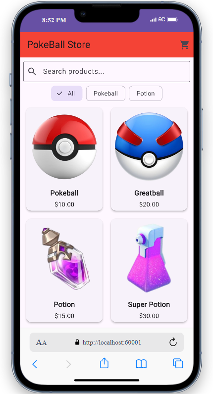
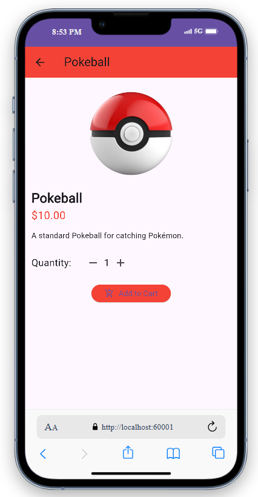
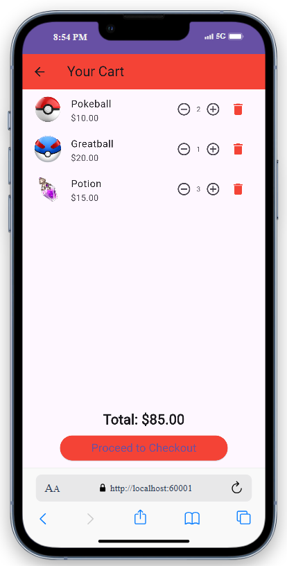
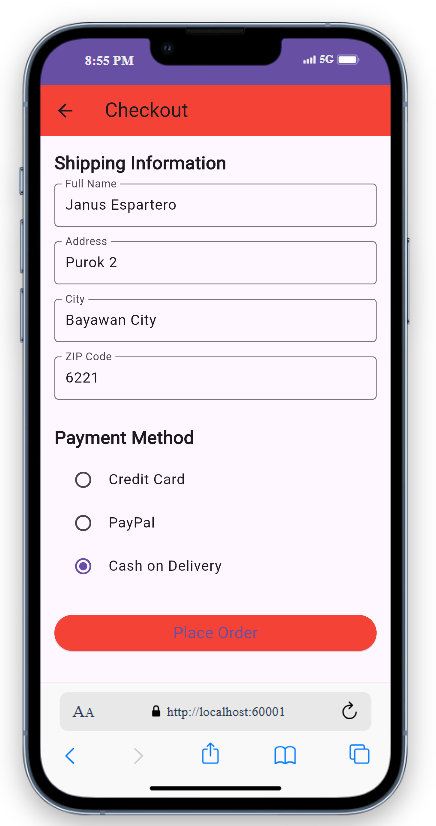
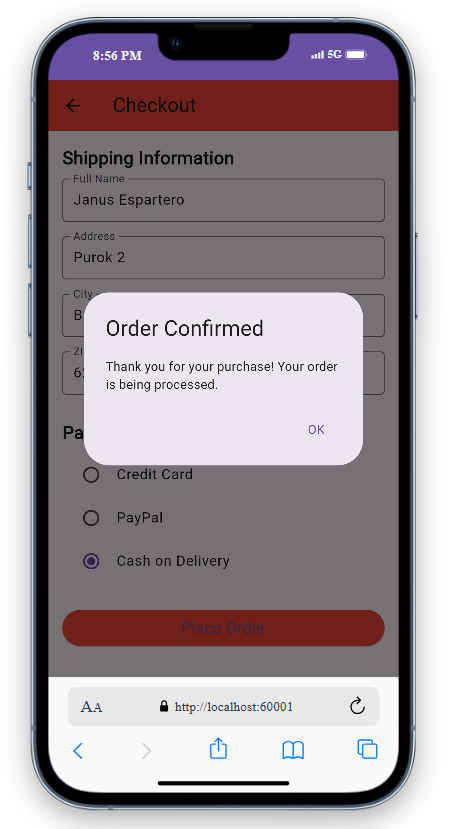

# PokeStore

**Student Name:** Janus Marco L. Espartero  
**Student ID:** 2023-219841

---

## 📦 Project Description

**PokeStore** is a niche e-commerce mobile application that offers a specialized selection of Pokémon-related items, focusing on **Poké Balls** and **Potions**. The app provides a clean, responsive, and visually engaging user interface to simulate a shopping experience within the Pokémon universe. It was built entirely using **Flutter**, with an emphasis on **UI/UX design**, **user interaction**, and smooth navigation.

---

## ✅ Implemented Features

### 🏠 Home Screen
- Displays a **grid of products** categorized as "Poké Balls" and "Potions".
- Includes a **filter dropdown** to switch between item categories.
- Features a **search bar** to find products by name.
- Tapping a product navigates to the **Product Detail Screen**.
- **Cart icon** in the AppBar allows quick access to the cart.

### 🔍 Search Functionality
- Real-time search field in the AppBar.
- Dynamically filters visible products based on keyword input.

### 📄 Product Detail Screen
- Displays a **larger image**, full product description, name, and price.
- Allows the user to **select quantity**.
- Includes an **Add to Cart** button.

### 🛒 Cart Screen
- Lists all products added to the cart with their quantities.
- Users can **increase/decrease item quantity** or **remove items**.
- Shows **subtotal and total prices**.
- Includes a **"Proceed to Checkout"** button.

### 📦 Checkout Screen
- Multi-step form to enter:
  - Full Name
  - Address
  - City and Zip Code
  - Payment Method (Credit Card / PayPal)
- Final **Order Summary**.
- A **"Place Order"** button leads to a confirmation screen.

### ✅ Order Confirmation Screen
- Displays a simple **"Order Confirmed"** message after checkout.

---

## 🎨 Unique Design Choices & Creativity

### 🌟 Niche & Theme
- The app is centered around the Pokémon universe, specifically catering to Trainers looking to purchase Poké Balls and Potions.
- Chosen for its **nostalgia, familiarity, and fan appeal**.

### 🎨 Color Palette
- **Red and white** inspired by the iconic Poké Ball.
- Clean backgrounds and bold accent colors make key elements pop.

### 🔤 Typography
- **Roboto** font for clean, readable UI.
- Consistent font sizes and weights for hierarchy and clarity.

### 🎯 Iconography
- Material Icons for a cohesive and modern look.
- Poké-themed imagery for product visuals.

### 🧩 Innovative UI/UX Features
- **Category Filtering** with dropdown selector.
- **Real-time search** integrated directly into the Home AppBar.
- **Custom `ProductCard` widget** for reusable, styled product display.
- **Animated transitions** between screens for a smooth experience.

---

## 🧠 Challenges Faced & Solutions

### 🖼️ 1. Asset Image Loading Issues
**Challenge:** Some product images weren’t showing correctly.  
**Solution:** Ensured all file paths were lowercase and in `.png` or `.jpg` format. Updated `pubspec.yaml` and converted `.jfif` files using online tools to avoid compatibility issues.

### 🔍 2. Implementing Real-Time Search
**Challenge:** Managing state updates as users typed into the search bar.  
**Solution:** Used a `TextEditingController` and `setState()` to dynamically filter the product list as the user typed, resulting in a responsive search experience.

---

## 📸 Screenshots

> *(Insert your screenshots here after running the app on a simulator/emulator and capturing each key screen. Upload to your repo or local directory and link like below:)*

  
*Home Screen with category filter and search*

  
*Detailed view of a selected product*

  
*Shopping cart with item controls*

  
*Multi-step checkout interface*

  
*Simple final screen after order placement*

---

## 🚀 Technologies Used
- Flutter (v3+)
- Dart
- Material Design Components

---

## 📂 How to Run

```bash
flutter pub get
flutter run
    